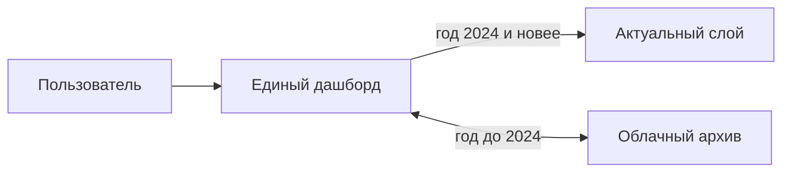

# Архитектура дашборда

## Схема (как задумано)

| Слой | Годы | Хранение | Когда обновляется |
|------|------|----------|-------------------|
| **Актуальный** | 2024–2026 (и далее) | `bdmoSnapshot.ts` + `operationalSnapshot.ts` в репозитории | GitHub Actions: `refresh-data.yml`, деплой `pages.yml` |
| **Архив** | 2003–2023 | JSON в облаке: `<VITE_ARCHIVE_DATA_URL>/<year>/<indicatorId>.json` | Отдельная выгрузка BDMO в облако |

## Поток в интерфейсе

1. Пользователь выбирает **год**.
2. Если год **≥ 2024** — рейтинг и карточка района из **встроенного снимка** (hot).
3. Если год **< 2024** — список показателей из полного каталога, рейтинг **подгружается из облака** (если задан `VITE_ARCHIVE_DATA_URL`).

## Источники в актуальном слое

| Источник | Годы | Показатели |
|----------|------|------------|
| БД ПМО (tochno.st) | 2024–2025 | ~178 показателей, 63 МО |
| Открытые данные РБ (opendata.sf2) | 2026 | 9 показателей (здравоохранение), 63 МО |

В списке показателей только позиции с **ненулевыми** значениями за выбранный год.

## Режимы запуска

| Режим | Данные |
|-------|--------|
| **GitHub Pages** | Только актуальный снимок (`import.meta.env.PROD` → `staticData`) |
| **Локально** | API `npm run dev:api` + те же снимки в `DataStore` |

## Файлы

- `src/data/seed.ts` — объединение снимков
- `src/client/staticData.ts` — чтение для Pages
- `src/client/archiveData.ts` — архив по URL
- `scripts/generate_bdmo_snapshot.py` — hot BDMO
- `scripts/generate_operational_snapshot.py` — hot opendata
